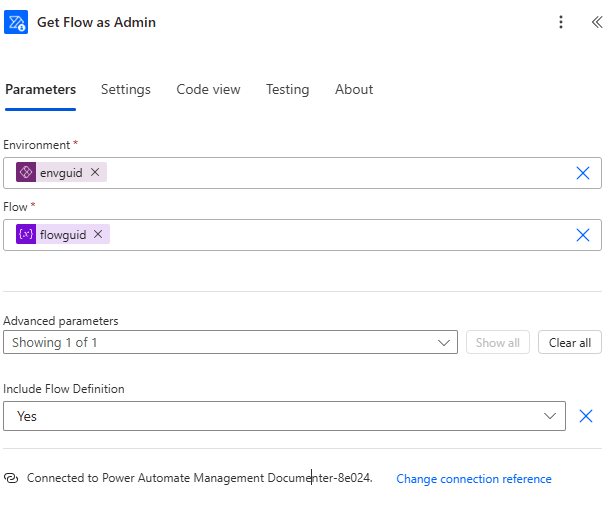
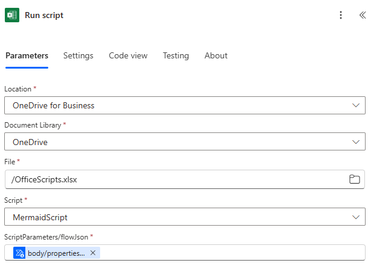
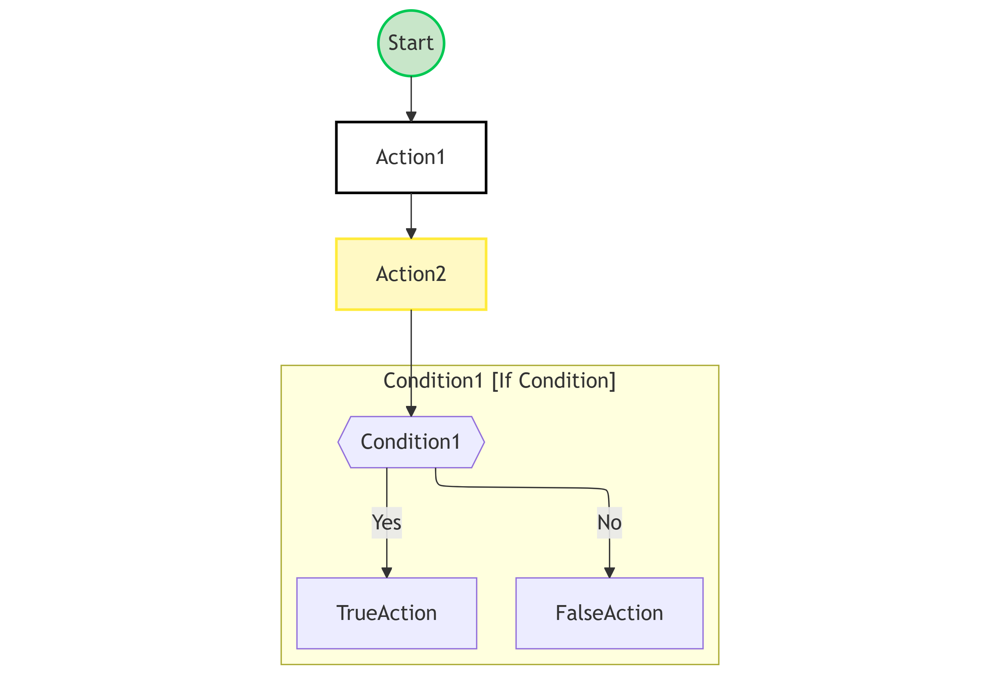

# OfficeScript Mermaid Diagram Generator

This repository contains an OfficeScript function that generates a Mermaid diagram from a flow definition (in JSON format) retrieved via Power Automate. The diagram visualizes the flow—including actions and dependencies—using enhanced styling with Mermaid subgraphs for conditions, switches, and scopes.

---

## Overview

The main function, `main`, performs the following tasks:

- **JSON Parsing & Validation:**  
  Parses a JSON string representing a flow definition. If the JSON structure is invalid or the expected actions cannot be found, an error is thrown.

- **Global Actions Mapping:**  
  Recursively builds a map of all actions (including nested actions) to handle dependencies correctly.

- **Mermaid Diagram Construction:**  
  Generates a Mermaid diagram (in string format) that represents the flow. It creates nodes for actions, connects them based on dependencies (using `runAfter`), and uses subgraphs for complex actions like conditions and switches.

- **Custom Styling:**  
  Applies specific styles and shapes based on the action type (for example, diamond for conditions, rectangle for simple actions).

- **Logging:**  
  Outputs informational and warning messages during processing to assist with debugging.

---

## Retrieving the Flow Definition

1. **Use the Get Flow as Admin Connector**

   In Power Automate, add the **Get Flow as Admin** connector:

   - Provide the **Environment** and **Flow** IDs.
   - Under **Advanced parameters**, set **Include Flow Definition** to **Yes**.

   The flow definition is then accessible via:
   
       outputs('Get_Flow_as_Admin')?['body/properties/definition']

   

   *This screenshot shows the setup of the Get Flow as Admin connector.*

---

## Hosting and Running the OfficeScript

### Hosting the OfficeScript

1. **Save the Script in Excel Online**
   - Open Excel Online via OneDrive or SharePoint.
   - Open or create a workbook (for example, `OfficeScripts.xlsx`).
   - Navigate to the **Automate** tab and click **New Script**.
   - Paste your OfficeScript code (the Mermaid diagram generator) into the script editor.
   - Save the script with a descriptive name (for instance, `MermaidScript`).

2. **Publish the Workbook**
   - Ensure that the workbook is stored on OneDrive for Business or SharePoint so that it can be accessed by Power Automate.

### Configuring the Run OfficeScript Connector

Use the **Run script** action (from **Excel Online (Business)**) in Power Automate to execute your OfficeScript. Configure the connector with the following details:

- **Location:** OneDrive for Business (or SharePoint, if your file is hosted there).
- **Document Library:** Your OneDrive or SharePoint document library.
- **File:** Path to the Excel file containing your OfficeScript (for example, `/OfficeScripts.xlsx`).
- **Script:** Name of your script (for example, `MermaidScript`).
- **ScriptParameters/flowJson:** Directly reference the flow definition from the **Get Flow as Admin** connector output, like so:

       outputs('Get_Flow_as_Admin')?['body/properties/definition']

*This screenshot shows the Run OfficeScript connector configuration with the required parameters.*

---

## Example Flow Definition

Below is a simple, generic example of a flow definition in JSON format:

    {
      "$schema": "https://schema.example.com/flowdefinition.json",
      "contentVersion": "1.0.0",
      "actions": {
        "Action1": {
          "type": "InitializeVariable",
          "inputs": {
            "variables": [
              {
                "name": "Var1",
                "type": "string"
              }
            ]
          }
        },
        "Action2": {
          "runAfter": {
            "Action1": ["Succeeded"]
          },
          "type": "SetVariable",
          "inputs": {
            "name": "Var1",
            "value": "Hello World"
          }
        },
        "Condition1": {
          "type": "If",
          "runAfter": {
            "Action2": ["Succeeded"]
          },
          "actions": {
            "TrueAction": {
              "type": "Compose",
              "inputs": "True branch executed"
            }
          },
          "else": {
            "actions": {
              "FalseAction": {
                "type": "Compose",
                "inputs": "False branch executed"
              }
            }
          }
        }
      }
    }

---

## Example Mermaid Diagram Output

When the script runs, it produces a Mermaid diagram similar to this:

    ---
    config:
      layout: elk
    ---
    graph TD
    Start((Start))
    style Start fill:#C8E6C9,stroke:#00C853,stroke-width:2px;
    Start --> Action1
    Action1[Action1]
    class Action1 InitializeVariable;
    classDef InitializeVariable fill:#FFFFFF,stroke:#000000,stroke-width:2px;
    Action1 --> Action2
    Action2[Action2]
    class Action2 SetVariable;
    classDef SetVariable fill:#FFF9C4,stroke:#FFEB3B,stroke-width:2px;
    Action2 --> Condition1
    subgraph "Condition1 [If Condition]"
    Condition1{{Condition1}}
    class Condition1 If;
    Condition1 -- Yes --> TrueAction
    TrueAction[TrueAction]
    class TrueAction Compose;
    Condition1 -- No --> FalseAction
    FalseAction[FalseAction]
    class FalseAction Compose;
    end

You can render this output using any Mermaid-compatible tool (such as the [Mermaid Live Editor](https://mermaid.live/)) or directly in GitHub Markdown to view your flow diagram.

---

## Code Structure

- **JSON Parsing & Validation:**  
  Validates the input JSON and extracts actions (even if nested).

- **Global Actions Map:**  
  Recursively maps all actions to correctly establish dependencies.

- **Mermaid Diagram Generation:**  
  Constructs the diagram by:
  - Defining a starting node (`Start`).
  - Processing each action and connecting them based on `runAfter` dependencies.
  - Creating subgraphs for condition (`If`) actions.
  - Applying custom styles based on action types.

- **Logging:**  
  Helper functions log the processing status to aid debugging.

---

## Contributing

Contributions to enhance functionality or fix issues are welcome! Please open an issue or submit a pull request with your suggestions.

---

## License

This project is licensed under the [MIT License](LICENSE).

---

## Support
If you'd like to support my work:

